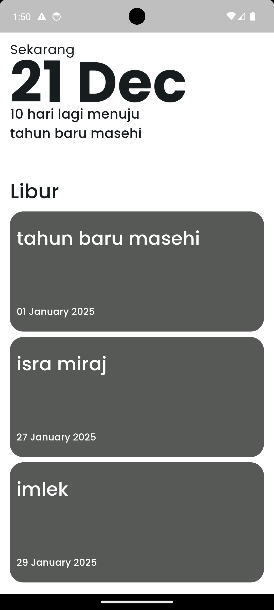

# **Libura**

**Your National Holiday Tracker**

Libura is a national holiday tracking application designed to help users stay informed about upcoming public holidays. Whether you're planning a vacation, organizing events, or simply staying on top of national holidays, Libura makes it easy to track, plan, and optimize your schedule based on holidays. With a simple and intuitive interface, Libura ensures you never miss a holiday again.

## Features

- **Track National Holidays**: Stay up to date with national holidays, including both official and regional holidays.
- **Holiday Countdown**: See a real-time countdown to the next holiday, so you're always prepared.
- **Filter Past and Upcoming Holidays**: View upcoming holidays while filtering out holidays that have already passed.
- **Holiday Details**: Get detailed information about each holiday, including its type, date, and significance.
- **Holiday Reminders**: Set reminders for specific holidays to help plan events or take time off work.
- **Intuitive Interface**: A user-friendly interface that makes navigating holiday schedules easy.

## Screenshots

Here are some screenshots of Libura in action:

_Home screen showing upcoming holidays and countdown._
